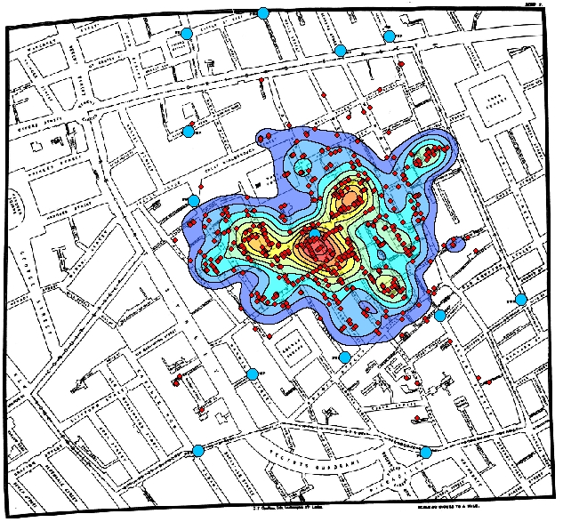
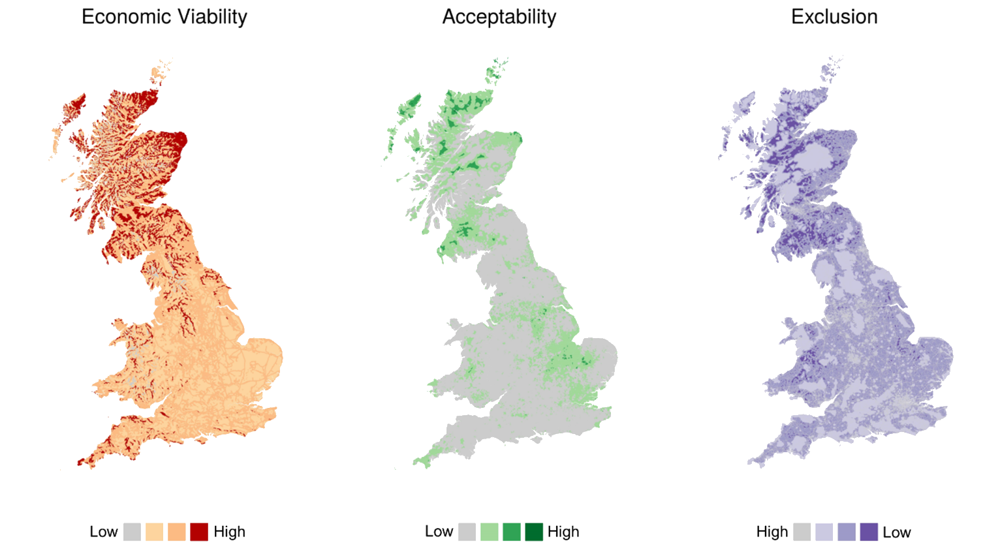
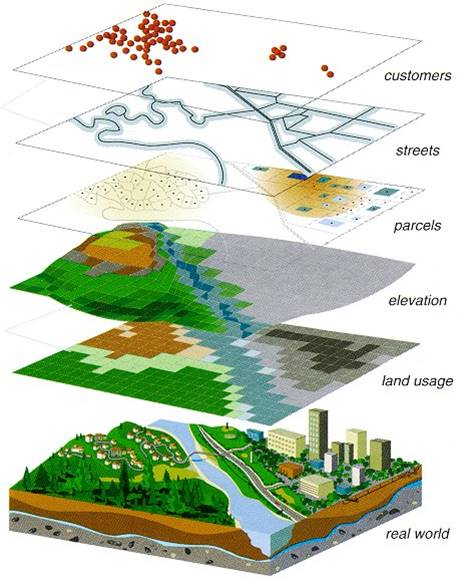
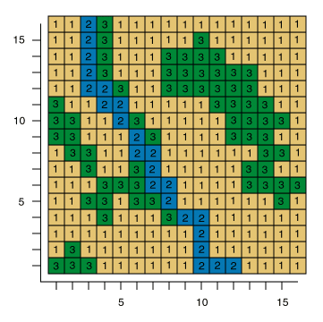

```{r setup, include=FALSE}
knitr::opts_chunk$set(echo = FALSE, out.width = "80%", fig.align = "center", tidy = TRUE, tidy.opts=list(width.cutoff=50))
```

## Uses of Spatial Data in Science 

\begincols
\begincol{.48\textwidth}

- spatial analysis: using location or spatial relationships as an **explanatory** or **predictive** variable
- examining the effects of **scale** 
  - backdrops to show **context**
  
  \endcol
\begincol{.48\textwidth}

```{r, out.width="100%", fig.cap= "Cholera Map of 1854 London Outbreak"}

```

\endcol
\endcols

## GIS vs. R

- Many tools options also available

  \begincols
\begincol{.48\textwidth}

```{r, }
knitr::include_graphics("../images/arcgis.jpg")
```

\endcol
\begincol{.48\textwidth}

```{r, out.width="50%"}
knitr::include_graphics("../images/RLogo.jpg")
```

\endcol
\endcols

- Other tools avaialble (QGIS, Python)

\begin{alertblock}{Which tool is best to use?}
Well, it depends on the task!
\end{alertblock}

## GIS vs. R

\begincols
\begincol{.48\textwidth}

  **GIS**
  
  - Visual interaction
- Data management
- Geometric operations
- Standard workflows
- Single map production
- Click, click, click, click
- Speed of execution

\endcol
\begincol{.48\textwidth}

**R**
  
  - Data and model focused
- Analysis
- Attributes as important
- Creativity and innovation
- Many (simpler) maps
- Repeatability (script)
- Speed of development

\endcol
\endcols

## R Examples (1)

```{r, out.width="75%", fig.cap="London Cycle Hire Journeys"}
knitr::include_graphics("../images/bike_ggplot.png")
```

http://spatial.ly/2012/02/great-maps-ggplot2/

## R Examples (2)

```{r, fig.cap="Wind Turbine Analysis of Great Britain", out.width="100%"}

```

## Challenges with Spatial Data in R

**Understanding and manipulating spatial data in R can be a real challenge!**

\begincols
\begincol{.48\textwidth}

- Many types and formats of spatial data
- R is not the easiest program to learn
- There are a many packages from a very diverse user community 

\endcol
\begincol{.48\textwidth}

```{r}

```

\endcol
\endcols


## Presentation Goals

\begincols
\begincol{.69\textwidth}

1. Help you get to the point where you can do basic analysis or visualization
2. Point out some of the commonly-used packages for spatial data manipulation and analysis
3. Be a resource you can come back to
4. Provide Guidance on useful resources to use after the course

\endcol
\begincol{.3\textwidth}

```{r, out.width="100%"}

```

\endcol
\endcols

\begin{alertblock}{Beware of the learning curve!}
Takes patience to master.
\end{alertblock}

## Outline

\begincols
\begincol{.7\textwidth}

1. Creating Spatial Objects
2. Data Table Operations
3. Coordinate Systems and Reprojection
4. Geoprocessing
5. Presenting Results

\endcol
\begincol{.3\textwidth}

\endcol
\endcols

\begin{alertblock}{Subjects Omitted}
More advanced visualization, Spatial statistics, Geodatabases, Network analysis, Many other...
\end{alertblock}

## Before We Start...

- Many  packages are used within the analysis.

```{r, echo=TRUE, message=FALSE, warning=FALSE}

library(rgdal) # loads geospatial libraries
library(rgeos) # dealing with geospatial files
library(sp) # spatial projections
library(raster) # loading rasters and geoprocessing
library(ggplot2) # Creating maps
library(spatstat) # Used for spatial statistics
```

- Don't worry for now. These will be explained in more detail later.

# PART I: Creating Spatial Objects

## Representing Physical Features

\begincols
\begincol{.4\textwidth}

```{r, out.width="100%", fig.cap="Representation of Figure Layers"}

```

\endcol
\begincol{.49\textwidth}

```{r, out.width="100%", fig.cap="Raster Features"}
knitr::include_graphics("../images/raster-features-abstract.png")
```

```{r, out.width = "100%", fig.cap="Vector Features"}
knitr::include_graphics("../images/vectors-features-abstract.png")
```

\endcol
\endcols

## Creating  SpatialPoints Objects

- The package \alert{sp} is primarily used for creating spatial data types
- The code `getClass('Spatial')` can be run to see all types

Three options to create spatial data in R:
  
1. Create from scratch
2. Promote a data frame with X and Y columns
3. Import a GIS file

- Methods 2 and 3 are most commonly used!
- Tutorial will focus on creation of Points

## Method 1: Create a SpatialPoints Object from Scratch

- Let's create an example dataset!

```{r create_pts, echo=TRUE}
library(sp)
#create a set of random coordinates
xy <- matrix(data=runif(n=100), ncol=2) 
head(xy, n=3) # show first three rows
```

- `SpatialPoints` function can be used to create a dataset from XY coordinates

```{r create_pts2, echo=TRUE}
xySp <- SpatialPoints(xy)
```

## Method 1: Create a SpatialPoints Object from Scratch

SpatialPoints can be plotted as typical XY data using the `plot()` function

```{r plotxy, echo=TRUE, fig.align="center", fig.asp=1, fig.height=4, fig.width=4, out.width="50%"}
plot(xySp, axes = TRUE, main = "Example Spatial Data Points")

```

## Method 2: Promote a DataFrame to a SpatialPointsDataFrame

- It is unlikely you will use Method 1 often
- You will more likely have an existing dataset with XY coordinates.
- For the tutorial, We will used the \alert{canada.cities} dataset from the \alert{maps} package.

```{r load_canada_cities, echo=TRUE, message=FALSE, warning=FALSE}
library(maps)
head(canada.cities, n = 3)
```

- Data already has X (long) and Y (lat) references.

## Method 2: Promote a DataFrame to a SpatialPointsDataFrame

- We must let R know which columns are the X and Y coordinates

```{r promote_data_frame, fig.align="center", echo=TRUE}
# Create a new variable to edit the data
cities <- canada.cities

# State which columns contain the x and y coordinates
coordinates(cities) <- ~long + lat
```

- By assigning coordinates we create a SpatialPointsDataFrame:

```{r, echo=TRUE}
class(cities)
```

## Method 2: Promote a DataFrame to a SpatialPointsDataFrame

We can map the results of the SpatialDataFrame as before:

```{r, echo=TRUE, fig.height=4, fig.width=8}
plot(cities, axes = TRUE, main = "Cities in Canada", 
     xlab = "Longitude", ylab = "Latitude")
```

- This map is not very useful yet! We will add to this map later!

## Method 3: Import a GIS File

- Package \alert{rgdal} has a large set of import and export filters for both vector and raster GIS data (Shapefiles, KML, GPX etc.).
- For the complete list of vector import filters, use the function `ogrDrivers()`.
- The tutorial will focus on **Shapefiles**, a commonly used format in GIS software.
- We will use the "scot_BNG" file.
- `readOGR()` is the function you use to import a vector file.


```{r get_vector, echo=TRUE, message=FALSE, warning=FALSE}
# Find the file path of the vectors
vectorDir <- system.file("vectors", package="rgdal")
scotland <- readOGR(dsn=vectorDir, 
                           layer="scot_BNG",
                           verbose = FALSE)
```

- Note: you don't need to include the file extension when loading the object

## Method 3: Import a GIS File

- Shapefiles are typically easy to plot straight away

```{r plot_scotland, fig.align="center", echo=TRUE}
plot(scotland, axes=T, asp=1, col=palette())
```

- We will come back to plotting again later!

# PART II: Working With SpatialDataFrames

## Working with the Data Frame

- You can work with the data frame as you would with any data frame
- To use the attribute table of a SpatialPointsDataFrame, use the **data** slot (with '@' character):

\begincols
\begincol{.48\textwidth}

```{r, echo = TRUE}
names(cities@data) 

```

\endcol
\begincol{.48\textwidth}

```{r, echo = TRUE}

```

\endcol
\endcols
  
- What happened to the coordinates?
- We can read them with the `coordinates()` function

```{r head_coordinates, echo = TRUE}
coordinates(cities)[1,]
```

## Calculating Summaries

- SpatialDataframes can *mostly* be treated like a normal Dataframe

```{r, echo=TRUE}
mean(cities$pop) # Calculate Mean population
```

```{r, echo=TRUE, fig.height=1.5, fig.width=4}

ggplot2::qplot(x="", y=cities$pop, geom="boxplot", 
      main = "A questionable boxplot", 
      ylab = "Population") + coord_flip()
```

## Adding a Column to the Data Frame of a SPDF Object

- Calculate new columns in the data frame

```{r, echo = TRUE}
# Calculate the size order of cities
cities$sizerank <- rank(-cities$pop)

head(cities@data, n = 5)
```

## Filter on an Attribute

- Standard R syntax can be used to filter SpatialDataFrames.^[Check out http://www.statmethods.net/management/subset.html]

```{r plot_big_cities, echo=TRUE}
# Filter cities by those with a population more than 100,000
BigCities<- cities[cities$pop > 100000, ]

# Count how many cities meet criteria
nrow(BigCities)
```

## Filter on an Attribute

\small
```{r, fig.cap="Subsetting of spatial dataframes", fig.width=8, fig.height=4,echo = TRUE, out.width="100%"}
par(mfrow=c(1,2)) # Plot graphs side by side
plot(cities, axes=T, asp=1, pch=16, main = "Original")
plot(cities, axes=T, asp=1, pch=16,
     main = "Highlighing Big Cities")
plot(BigCities, pch=1, col="red", cex=3, add=TRUE)

```
\normalsize

## Enriching Data

- You may want to link data to your spatial data
- e.g. deomgraphic data to census wards

```{r}
knitr::include_graphics("../images/Join.png")
```


## Enriching Data: Example

- Let's join some census data with shapefiles for the Southampton region

```{r, echo = TRUE}
# Load Shapefile
Solent <- readOGR(dsn = "../data/SolentLEP", "Solent_revised", verbose = FALSE)
head(Solent[1:4], n = 2)
nrow(Solent)
```

## Enriching Data: Example

- We can load some Census Data

```{r, echo = TRUE, tidy = FALSE}
# Age data for all of the UK
AgeData <- read.csv("../data/MedianAge.csv", 
                    stringsAsFactors = FALSE)
head(AgeData,n=3)
nrow(AgeData)
```

- The age data has records for the whole of England

## Enriching Data: Example

- We can easily merge the age data with the boundary data using the `merge()` function

```{r, echo = TRUE}
# Merge Datasets
SolentMerged <- merge(Solent, AgeData, by.x="OA11CD", by.y = "GeographyCode")
# Lets focus on Southampton
Southampton <- SolentMerged[SolentMerged$LAD11NM == "Southampton", ]
```

## Enriching Data: Example

```{r, fig.cap="Median Age with Output Areas in Southampton. Data from 2011 Census", out.width="70%", echo = TRUE}
spplot(Southampton, "MedianAge", main = "Median Age (years)")
```

# PART III: Coordinate Reference Systems

## Coordinate Reference Systems (CRS)

\begincols
\begincol{.65\textwidth}

- Very important! R won't give you a warning when loading like in ArcGIS.
- You don't always need to give one, but it is recommended to always do.
- If you create spatial data, **you will usually have to specify** the projection.
- packages \alert{sp} and \alert{rgdal} are used for managing CRS.

\endcol
\begincol{.34\textwidth}

```{r, out.width="50%"}
knitr::include_graphics("../images/CRS.png")
```

\endcol
\endcols

\begin{alertblock}{Find out more}
A useful guide is provided here about spatial projection in R \url{https://goo.gl/FAsv4k}
\end{alertblock}

## Coordinate Systems: Example

- Earlier, we created the SpatialDataFrame of Canadian Cities called `cities`.
- We can check the spatial projection using the function `crs()`

```{r, echo=TRUE}
crs(cities)
```

- Currently the data has no CRS! We need to assign one
- Dataset has WGS84 projection, which is the mostly commonly used

```{r, echo = TRUE}
# Assign Projection to Cities
crs(cities) <- CRS("+init=epsg:4326")
```

\begin{alertblock}{Find out spatial projection codes}
An online registry of spatial projections is available at \url{http://www.epsg-registry.org} for Coordinate Reference Systems
\end{alertblock}

## Coordinate Systems: Example

- We will load data for administrative borders in Canada using the  function `getData()` from the \alert{raster} package ^[This provides global vector and raster data for countries, administrative boundaries, altitude models and climatic data.].

```{r, echo = TRUE, cache = TRUE}
# Load Canada Data
canada <- raster::getData("GADM", country="CAN", level = 0, download = FALSE, path="../data")
# Check Coordinate System
crs(canada)

```

## Coordinate Systems: Example

```{r}
crs(BigCities) <- CRS("+init=epsg:4326")
```

```{r PlotCanada, echo = FALSE, out.width="75%", eval=FALSE}
# Plot the map and the cities together
plot(canada, col="grey90", axes=T, 
     main = "Location of Canadian Cities with population greater than 10000")
plot(BigCities, add=TRUE)

```

## Example: Reprojecting
 
- The function `spTransform()` can be used to reproject a CRS

```{r, echo = TRUE, fig.asp="70%"}
GB <- raster::getData("GADM", country="GBR", level = 1, path = "../data")
GB_BNG <- spTransform(GB, CRS("+init=epsg:27700"))
```

```{r, fig.cap="Comparison of coordinate systems", fig.height=6}
par(mfrow=c(1,2)) # Plot graphs side by side

# Original Plot
plot(GB, axes=T, main = "WGS 1984 Coordinate System", col = "grey90")

# Make Second Plot Highliging Big Cities
plot(GB_BNG, axes=T, main = "British National Grid", col = "grey90")
```

# PART IV: Geoprocessing

## Geoprocessing: rgeos package

\begincols
\begincol{.69\textwidth}

- \alert{rgeos} is the main package used within R for geospatial analysis
- interface to GEOS (Geometry Engine Open Source) Library

\endcol
\begincol{.3\textwidth}

```{r}

```

\endcol
\endcols

\begin{alertblock}{Example Processes}
Union, distance, intersection, convex hull, envelope, buffer, simplify, polygon assembly, valid, area, length, intersects, touches, disjoint, crosses, within, contains, overlaps, equals, covers, etc.
\end{alertblock}

## Buffer

- apply a 2km buffer to the county of Inverness

```{r, echo=TRUE}
inver <- scotland[scotland$NAME == "Inverness", ]
inver_buf <- gBuffer(inver, width=2000)
```

```{r buf_inverness, fig.align="center", fig.width=6, fig.asp=1, out.width="50%"}
plot(inver, axes=TRUE, asp=1, main = "Buffer")
plot(inver_buf, border="blue", lty=2, lwd=2, add=TRUE)
```

## Delaunay Triangulation

- Form Delaunay triangulation for the cities in Canada 

```{r delaunay_tri, fig.align="center", fig.width=6, fig.asp=1, out.width="50%", echo = TRUE}
delTri <- gDelaunayTriangulation(BigCities)
plot(delTri, axes=TRUE, , main = "Delaunay Triangulation")
plot(BigCities, col="red", pch=16, cex=2, add=TRUE)
```

## Spatial Proximity

- How far is it to the nearest city?
- \alert{spatstat} provides adds a spatial proximity functions.

```{r, echo=TRUE, message=FALSE, warning=FALSE, out.width = "90%"}
library(spatstat)
BigCities$Distance <- nndist(X = BigCities@coords)
spplot(BigCities, "Distance") # Plot Results
```

# PART V: Raster Data

## Raster package

\begincols
\begincol{.65\textwidth}

- Most control through `raster` package 
- Read, write and manipulate gridded spatial data
- Basic and high-level analysis functions 
- Processing of large files

\endcol
\begincol{.34\textwidth}

```{r, out.width="100%"}

```

\endcol
\endcols

## Raster Layer: Create from Scratch

```{r new_rast, echo = TRUE}
myrast <- raster(extent(c(0,20,0,20)), ncol=10, nrow=10)
myrast[] <- 1:100
myrast
```

## Raster Layer: Raster Algebra

- Rasters can be added, multiplied etc.

```{r plot_rast01, echo = TRUE, fig.asp=0.5}
par(mfrow=c(1,2)) # Plot graphs side by side
plot(myrast, main = "Raster Value", asp=1)
myrastSquared <- myrast^2
plot(myrastSquared, main = "Raster Value Squared", asp=1)
```

## Raster Data: Import a GeoTiff

- The `raster()` function from the \alert{raster} package can be used

```{r get_rasterdir_pictures, echo=TRUE, fig.cap="UK Annualised Wind Speed Map at 45m above ground level", fig.asp=1, out.width="45%"}
WindSpeedRaster <- raster(x = "../data/WindSpeed45.tif")
plot(WindSpeedRaster, "WindSpeed45")
```

## Raster Data: Crop a Raster

- `crop()` function can be used to clip a raster to a spatial extent

```{r crop_peru_rast, echo=TRUE, fig.align="center", fig.asp=1, out.width="45%"}

WindSpeedSolent <- crop(WindSpeedRaster, Solent)
plot(WindSpeedSolent, asp = 1)
```

## Overlay Points and Extract Values

- Generate Some Points Within The Solent Region
- The `spsample()` function from the package \alert{sp} can to produce a sample within a given extent 

```{r, echo = TRUE, fig.asp=1, out.width="50%"}
SolentPoints <- spsample(Solent, n = 25, type= "random")
SolentPoints$ID <- 1:nrow(SolentPoints@coords)
```

```{r extract_vals_at_pts01, fig.asp=1, out.width="45%", fig.height=4}
plot(WindSpeedSolent)
plot(SolentPoints, pch=16, col="red", cex=2, add =TRUE)
text(SolentPoints, labels = SolentPoints$ID, cex= 0.7, pos=3)
```

## Overlay Points and Extract Values

- You can use the `extract()` function to calculate the value at points.

```{r extract_vals_at_pts02, echo = TRUE}
extract(WindSpeedSolent, SolentPoints)
```

## Create a Distance Surface

- The function `distance()` can produce a proximity raster to the nearest spatial point
- We must first `rasterize()` the Vector data (SpatialPoints)

```{r distance_surface_create, echo = TRUE}
SolentPointsRast <- rasterize(SolentPoints, WindSpeedSolent, field=1)
dist2SamplePtsRast <- distance(SolentPointsRast)
```

```{r, fig.align="center", out.width="100%", fig.width=5.7, fig.height=2}
par(mfrow=c(1,3)) # Plot graphs side by side

plot(SolentPoints, col="red", pch=16, main = "Original Points")

plot(SolentPointsRast, main = "Rasterized Points", legend=FALSE, col = "black")

plot(dist2SamplePtsRast, main = "Proximity Raster")
plot(SolentPoints, col="red", pch=16, add=TRUE)


```


# PART VI: Displaying Results

## ggplot: the basics

\begincols
\begincol{.48\textwidth}

- Maps so far have been quite basic and produced with the functions `plot()` or `spplot()`
- Easy to produce, but not the most attractive
- Time to use \alert{ggplot2}
- Same procedure as building graphs, with a few minor differences
  
  \endcol
\begincol{.48\textwidth}

```{r, out.width="100%"}

```

\endcol
\endcols

\begin{alertblock}{Warning}
Don't worry if you don't understand all the examples. They can be used for future reference.
\end{alertblock}


## ggplot Example: A World Map

```{r, message=FALSE, warning=FALSE, out.width="100%"}
library(mapdata)
library(ggmap)

# Load Data and select countries
World <- map_data(map = "world")
World <- World[World$region != "Antarctica", ] # Remove Antartica as it looks bad on the map

# Select Highlight Regions
StudyRegions <- World[World$region == c("UK", "USA", "UAE", "Egypt", "Kenya", "Cameroon", "Hungary", "France", "Thailand", "Vietnam"),]

ggplot() + 
  geom_polygon(data = World, aes(x=long, y = lat, group = group), fill = "grey80", colour = "grey90", size = 0.25) + 
  geom_polygon(data = StudyRegions, aes(x=long, y = lat, group = group), fill = "steelblue") + 
  theme_nothing() + 
  theme(panel.background = element_rect(fill = 'gray99'),
        plot.margin = unit(c(0,0,0,0), "cm")) +
  coord_fixed(1.3)
```

## ggplot Example: A World Map

- Map made with less than 15 lines of code.

\tiny
```{r, eval=FALSE, echo=TRUE, message=FALSE, warning=FALSE, include=TRUE, tidy = FALSE}
library(mapdata)
library(ggmap)

# Load Data and select countries
World <- map_data(map = "world")
World <- World[World$region != "Antarctica", ] # Remove Antartica as it looks bad on the map

# Select Highlight Regions
StudyRegions <- World[World$region == c("UK", "USA", "UAE", "Egypt", "Kenya", "Cameroon",
                                        "Hungary", "France", "Thailand", "Vietnam"),]

ggplot() + 
  # Add the basemap
  geom_polygon(data = World, aes(x=long, y = lat, group = group), fill = "grey80", colour = "grey90", size = 0.25) + 
  
  # Add the higlihhted Countries
  geom_polygon(data = StudyRegions, aes(x=long, y = lat, group = group), fill = "steelblue") +
  
  # Coordinates
    coord_fixed(1.3) +
  
  # Themes
  theme_nothing() + 
  theme(panel.background = element_rect(fill = 'gray99'),
        plot.margin = unit(c(0,0,0,0), "cm"))
  

```
\normalsize

## ggplot Examples: a choropleth map

Another example from: http://docs.ggplot2.org/current/geom_map.html

```{r, out.width="100%"}
library(ggplot2)
crimes <- data.frame(state = tolower(rownames(USArrests)), USArrests)
library(reshape2) # for melt
crimesm <- melt(crimes, id = 1)
library(maps)

states_map <- map_data("state")


# Murder Map

# Data & Aesthetics
ggplot(crimes, aes(map_id = state, fill = Murder)) + 
  
  # Geometries
  geom_map(aes(fill = Murder), map = states_map, colour = "black") + 
  
  scale_fill_gradient(low = "#91cf60", high = "#fc8d59") +
  
  # Coordinates
  expand_limits(x = states_map$long, y = states_map$lat) + coord_map() +
  
  # Theme
  ggtitle("Murder Rates in the United States")
```

## ggplot Examples: a faceted map

```{r, out.width="100%"}

library(RColorBrewer)

# Faceted Map
ggplot(crimesm, aes(map_id = state)) + geom_map(aes(fill = value), map = states_map) + expand_limits(x = states_map$long, y = states_map$lat) +
facet_wrap( ~ variable)
```

## ggplot Examples: a choropleth map

\tiny
```{r, echo = TRUE, eval = FALSE}
library(ggplot2)
crimes <- data.frame(state = tolower(rownames(USArrests)), USArrests)
library(reshape2) # for melt
crimesm <- melt(crimes, id = 1)
library(maps)

states_map <- map_data("state")

# Murder Map

# Data & Aesthetics
ggplot(crimes, aes(map_id = state, fill = Murder)) + 
  
  # Geometries
  geom_map(aes(fill = Murder), map = states_map, colour = "black") + 
  
  scale_fill_gradient(low = "#91cf60", high = "#fc8d59") +
  
  # Coordinates
  expand_limits(x = states_map$long, y = states_map$lat) + coord_map() +
  
  # Theme
  ggtitle("Murder Rates in the United States")


# Faceted Map
ggplot(crimesm, aes(map_id = state)) + geom_map(aes(fill = value), map = states_map) + expand_limits(x = states_map$long, y = states_map$lat) +
facet_wrap( ~ variable)
```
\normalsize

## ggplot Examples: spatial Points

```{r, message=FALSE, warning=FALSE}

airports <- read.csv("https://raw.githubusercontent.com/jpatokal/openflights/master/data/airports.dat", header = FALSE)
colnames(airports) <- c("ID", "name", "city", "country", "IATA_FAA", "ICAO", "lat", "lon", "altitude", "timezone", "DST")

routes <- read.csv("https://raw.githubusercontent.com/jpatokal/openflights/master/data/routes.dat", header=F)
colnames(routes) <- c("airline", "airlineID", "sourceAirport", "sourceAirportID", "destinationAirport", "destinationAirportID", "codeshare", "stops", "equipment")


library(plyr)
departures <- ddply(routes, .(sourceAirportID), "nrow")
names(departures)[2] <- "flights"
arrivals <- ddply(routes, .(destinationAirportID), "nrow")
names(arrivals)[2] <- "flights"

airportD <- merge(airports, departures, by.x = "ID", by.y = "sourceAirportID")
airportA <- merge(airports, arrivals, by.x = "ID", by.y = "destinationAirportID")

library(ggmap)
map <- get_map(location = 'Europe', zoom = 4, messaging = FALSE)

# create the data set containing both departures and arrivals
airportD$type <- "departures"
airportA$type <- "arrivals"
airportDA <- rbind(airportD, airportA)

# map the data
# map + data points
ggmap(map) +
  geom_point(aes(x = lon, y = lat, size = sqrt(flights)), data = airportDA, alpha = .5) +
# panels according to type (departure/arrival) +
  ggtitle("Airports In Europe") +
  guides(fill=guide_legend(title="New Legend Title"))


```


## ggplot Examples: spatial Points

\tiny
```{r echo = TRUE, eval = FALSE, tidy=FALSE}
#data
airports <- read.csv("https://raw.githubusercontent.com/jpatokal/openflights/master/data/airports.dat", header = FALSE)
colnames(airports) <- c("ID", "name", "city", "country", "IATA_FAA", "ICAO", "lat", "lon", "altitude", "timezone", "DST")
routes <- read.csv("https://raw.githubusercontent.com/jpatokal/openflights/master/data/routes.dat", header=F)
colnames(routes) <- c("airline", "airlineID", "sourceAirport", "sourceAirportID", "destinationAirport", 
                      "destinationAirportID", "codeshare", "stops", "equipment")

library(plyr)
departures <- ddply(routes, .(sourceAirportID), "nrow")
names(departures)[2] <- "flights"
arrivals <- ddply(routes, .(destinationAirportID), "nrow")
names(arrivals)[2] <- "flights"

airportD <- merge(airports, departures, by.x = "ID", by.y = "sourceAirportID")
airportA <- merge(airports, arrivals, by.x = "ID", by.y = "destinationAirportID")

map <- get_map(location = 'Europe', zoom = 4, messaging = FALSE)

# create the data set containing both departures and arrivals
airportD$type <- "departures"
airportA$type <- "arrivals"
airportDA <- rbind(airportD, airportA)

ggmap(map) +
  geom_point(aes(x = lon, y = lat, size = sqrt(flights)), data = airportDA, alpha = .5) +
# panels according to type (departure/arrival) +
  ggtitle("Airports In Europe") +
  guides(fill=guide_legend(title="New Legend Title"))

```
\normalsize

# Conclusions

## When to Use GIS vs. R?

**GIS**

- no mapping experience
- one-off maps
- serious cartography
- your data live in a geodatabase

**R**
  
- no money for commercial software
- need repeated analysis
- integration with other analyses
- development of new methods
- working with large raster files

## Additional Resources

**Overview of Spatial Packages**

- http://cran.r-project.org/web/views/Spatial.html

**Books**

```{r, out.width="30%"}
knitr::include_graphics("../images/applied_spatial_data_analysis.jpg")
```


## Additional Resources

**Tutorials**

- http://rpubs.com/RobinLovelace/11869
- http://science.nature.nps.gov/im/datamgmt/statistics/r/advanced/spatial.cfm
- http://spatial.ly/r/
  - http://gis.stackexchange.com/questions/45327/tutorials-to-handle-spatial-data-in-r
- https://pakillo.github.io/R-GIS-tutorial/
  
  **R Spatial Cheatsheet**

- http://www.maths.lancs.ac.uk/~rowlings/Teaching/UseR2012/cheatsheet.html
- https://github.com/wegmann/RSdocs/releases/download/May2014_spatial/AniMove_refcard.pdf

## Summary

\begincols
\begincol{.69\textwidth}

1. Help you get to the point where you can do basic analysis or visualization
2. Point out some of the commonly-used packages for spatial data manipulation and analysis
3. Be a resource you can come back to
4. Provide Guidance on useful resources to use after the course

\endcol
\begincol{.3\textwidth}

```{r, out.width="100%"}

```

\endcol
\endcols

\begin{exampleblock}{}
Hopefully you have ticked a few of these boxes!
\end{exampleblock}

# Thank You for Listening!

